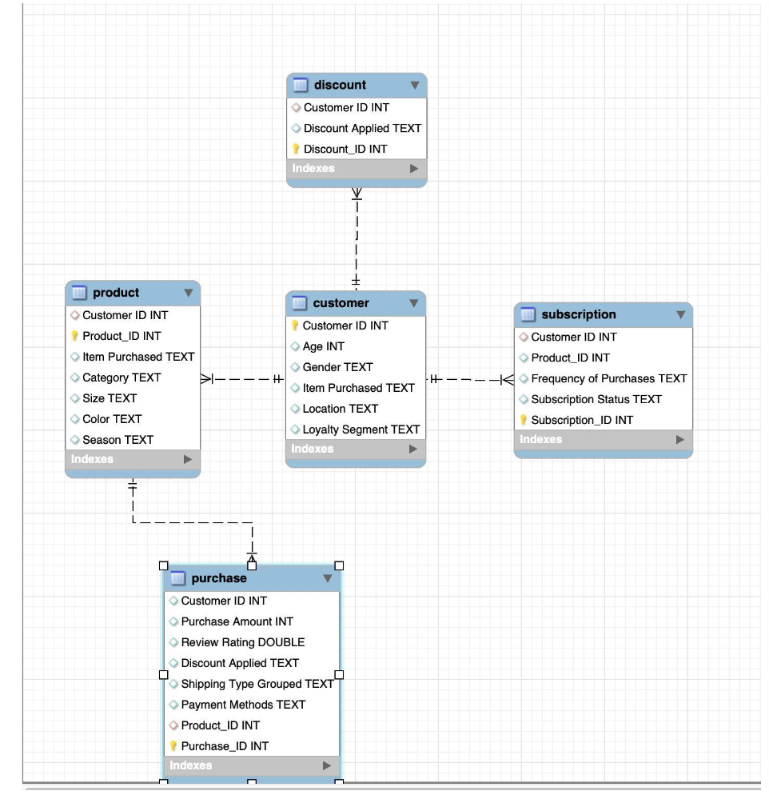

# Consumer Shopping Behavior Analysis

## Project Files

* 📊 [Final Presentation](Beacon%20Retail%20Analytics%20%281%29.pdf)
* 📄 [Project Summary](project-summary.pdf)
* 🗂️ EER Diagram (shown below)

## Database Design (EER Diagram)

## Overview

This project analyzes consumer shopping behavior through a combination of database design, SQL-based analysis, and business-focused reporting. The work was developed across multiple reports and consolidated into a final presentation to highlight both technical design and analytical insights.

## Objective

The goal of this project was to design a structured database for consumer shopping behavior data and use it to identify meaningful purchasing patterns, trends, and business insights.

## Project Scope

This project included:

* Relational database design
* Schema development and normalization
* EER diagram creation
* SQL-based querying and analysis
* Business insight presentation through reports and slides

## Key Contributions

* Designed a structured relational database for consumer shopping behavior data
* Applied normalization concepts to improve database organization
* Built an EER diagram to represent entities, attributes, and relationships
* Wrote SQL queries to analyze customer behavior and shopping trends
* Presented findings through a final business-focused presentation

## Tools Used

* SQL
* Database Design
* EER Modeling
* Data Analysis
* Presentation Design

## Repository Contents

This repository will include:

* Final presentation
* Polished summary of the project
* SQL scripts
* EER diagram
* Supporting visuals

## Outcome

This project combined database design and analytics to transform raw consumer shopping data into a structured system for generating useful business insights.
